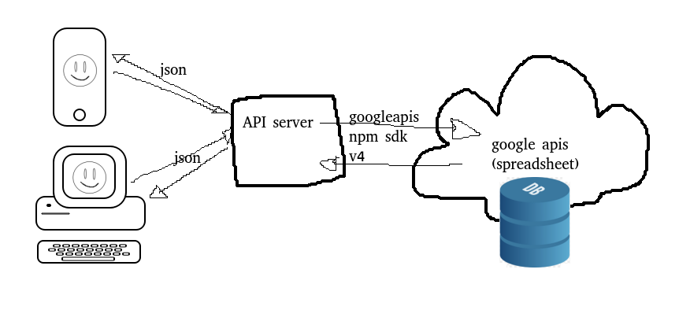

# simple API to google spreadsheet

This project creates an API server that sits between a google spreadsheet and you!



> using a spreadsheet as your DB!

## run

| :information_source: | all CLI examples try to follow this [command line syntax](https://docs.microsoft.com/en-us/windows-server/administration/windows-commands/command-line-syntax-key)  |
|-|-|

| :warning: | you must do 6 _extremely painful_ manual steps to get this server to work! |
|-|-|

1. copy the example configuration file `config.sample.json` to `config.json`, and we will fill it in with values in the following steps.

1. **Who are you?!** To run, the server expects a service-account credential JSON file to reside in the project root (where .git is located). The file _must_ be named `service-account-credentials.json`. To create and download this JSON file, follow this guide: https://cloud.google.com/docs/authentication/production#create_service_account

2. **What spreadsheet?!**. You must have a spreadsheet id (to identify _which_ spreadsheet to work with), copy the id from the URL of a spreadsheet _you_ own. In the `config.json` file, substitute `spreadsheet_id` with the _actual_ id of your spreadsheet. You can get this from the URL of a spreadsheet on its webpage.  

For example the URL

```
https://docs.google.com/spreadsheets/d/1qcmxYjLvM4dXmT4aKg3lkc_BJdUhItQrvR1tWXmIbbA/edit
```

has the spreadsheet id:
```
1qcmxYjLvM4dXmT4aKg3lkc_BJdUhItQrvR1tWXmIbbA
```

4. (optional) **What _range_ inside the spreadsheet?!?!** You have to define where the valuable data resides _within_ the spreadsheet, to get an idea of ranges, read https://spreadsheet.dev/range-in-google-sheets. The default of this is `A:B` (assumes data is stored in the _first two columns inside a contiguous block of rows_ (no empty rows) of data). Ranges let you re-use existing spreadsheets that might not look "clean", or where data resides in a different sheet/page _within_ the spreadsheet. substitute the `range` value of the `config.json` file with your desired range.

4. **Share it!**. For the service-account to get access to this spreadsheet, you must share it with the service-account. Inside the `service-account-credentials.json` file, there should be a property called `client_email`, share the document with this email from the spreadsheet web GUI.

4. **Run it! :heavy_check_mark: :100: :tada:** The server is written in Node.js, so to run it, you must have `node`, `npm`.

```shell
npm i
npm start
```

### configuration

the `config.sample.json` file should list all the potential configuration properties. Hopefully they are self exlanatory, but if not, here is an attempt to clarify:

```json
{
    "port": 3001, // optional! if removed it defaults to 3001
    "spreadsheet_id": "YOUR_SPREADSHEET_ID", // required!
    "range": "A:B", // required!
    "api_keys": ["Key1", "Key2"] // optional! if removed or set to [] it will disable authorization
}
```

## API doc

| :warning: | this doc shows example values with a range `A:B` (aka. data stored in the _first two columns_) |
|-|-|

| :warning: | by default the API is permissive, so the examples show no Authorization, see the configuration to change the defaults & make the API more secure |
|-|-|

### POST /rows
headers:

- Content-Type:application/json

body:
```json
{
    "rows": [
            ["2020-01-02", "bad"]
        ]
}
```

### GET /rows

response:
```json
{
    "rows": [
            ["day", "health"],
            ["2020-01-01", "good"],
            ["2020-01-02", "bad"]
        ]
}
```

### CURL examples 

insert data:
```shell
curl -s localhost:3001/rows -d '{"rows":[["2020-01-04","fantastic"]]}' -H 'Content-Type:application/json'
```

get data:
```shell
curl -s localhost:3001/rows
```

